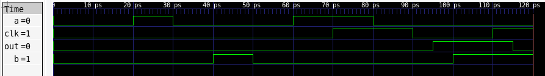
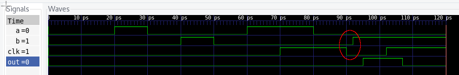

==========
VCD Assert
==========

.. image:: https://travis-ci.org/pleroux0/vcd_assert.svg?branch=master
  :target: https://travis-ci.org/pleroux0/vcd_assert

.. image:: https://codecov.io/gh/pleroux0/vcd_assert/branch/master/graph/badge.svg
  :target: https://codecov.io/gh/pleroux0/vcd_assert

VCD Assert's main goal is to validate post-placed and routed RSFQ circuits. It
does this by handling reading in a VCD file generated from a simulator and
checking that none of the events caused timing failures. It is done in a way
that would allow back-annotation as well as different types of technologies.

Small detailed example
======================
In the `one_bit_adder_success` the simulator outputs the following

.. code-block:: bash

  mkdir -p iverilog_out
  cd iverilog_out
  iverilog -gspecify -s tb_basic_xor -o run ../*.v
  vvp ./run

Running vcd_assert command

.. code-block:: bash

  vcd_assert tb_basic_xor.vcd ../tb_xor.v ../xor.v -t tb_basic_xor --node "tb_basic_xor --sdf ../xor.sdf

The finishes with

.. code-block:: bash

  FINISHED: No timing violations occured

Which is correct, but if we crunch one of the signal times from the
`tb_basic_xor` to force a timing violation. Which is depicted in
`basic_xor_fail`. Rerunning the iverilog we get

The red circle in the image shows where the fialure occurs. If we rerun the
`vcd_assert` command as well we see that it picks up the timing violation.

During the stream

.. code-block:: bash

  ASSERT: Triggered (HOLD b (COND internal_state_1 (negedge clk)) (25))
  ASSERT: Timing violation(s) occurred during scalar value change
          at time 92000fs from line 82 and col 0

and at the end

.. code-block:: bash

  FINISHED: Timing violation(s) did occur

Command line arguments
======================

.. code-block:: bash

  VCD Assert 1.0.0 Release (Aug 14 2018 11:26:11)
  Copyright (C) 2018 Paul le Roux and Calvin Maree, Stellenbosch University
  Licensed under the BSD 2-Clause License

  Working directory : /home/xonar/Code/vcd_assert/build/gcc8-debug

  Usage: ./bin/vcd_assert [OPTIONS] vcd_file [verilog_files...]

  Positionals:
    vcd_file FILE REQUIRED      VCD file
    verilog_files FILE ...      Verilog source file(s)

  Options:
    -h,--help                   Print this help message and exit
    -t,--top TEXT               Name of top verilog module
    -n,--node TEXT ...          VCD Node
    -s,--sdf FILE ...           SDF File to apply
    -v,--verbose                Verbosity level [1-3]

More detailed explanation of the arguments are given in `docs/arguments.rst`

Motivation
==========
There are plenty of commercial tools capable of handling post placed and routed
timing violations, but they are costly and make results difficult to reproduce.
The open-source verilog simulators are either unmaintained or poorly suited for
timing verification.

Alternatives
------------

IVerilog:
~~~~~~~~~

The best open-source verilog simulator available, but it doesn't support SDF
files properly and doesn't support timing assertions at all. It instead
silently ignores them. It is still a good verilog engine and we recommend using
It to generate the VCD files that are sent to `vcd_assert`

CVer
~~~~

Not maintained anymore, but the only open-source simulator we could find that
handles timing assertions. It is prone to crashes and quite picky about what it
accepts as input. It also seldom gives meaningful error messages. It is not
optimized and doesn't do any optimizations on the Verilog before starting the
simulation making it slower, but it does work. There are also edge cases where
it incorrectly simulates verilog.

Commercial alternatives
~~~~~~~~~~~~~~~~~~~~~~~
Since we do not have access to any of the commercial verilog simulators we
can't know if they work or not, but since SDF and Verilog are standardized we
trust that most commercial simulators will be able to handle it.

Building
========

If you already have everything setup

.. code-block:: bash

  git clone "https://github.com/pleroux0/vcd_assert"
  mkdir vcd_assert/build
  cd vcd_assert/build
  conan install ..
  conan build ..

For detailed building instructions please go to `docs/building.rst`

Status
======
Working

Knowns problems
---------------

There is a very small memory leak (few kB after parsing the verilog files).
The leaks are orignating somewhere in the ANTLRv4 runtime. This is the cause of
the clang sanitize address and valgrind failure on travis. We are looking into
it.

The files generated by ANTLRv4_ are full of warnings and is causing our
clang-tidy build on travis to fail.

The failure of clang undefined sanitizer is running out of memory on the travis
machine. The cause of the memory spike is during compilation is still unknown,
but it doesn't affect the executable compiled without the `-fsanitize=undefined`
flag.

Limitations
-----------

* Handle verilog files with complicated preprocessor usage
* Handle any generate expressions (Which doesn't occur in post placed and
  routed circuits). This is because there is no way to access the generated names
  output from the vcd and verilog from outside the simulator.
* We only look at the timing checks in the SDF file (using the verilog only to
  get module types) and we don't match them with that of the Verilog file.

Acknowledgements
================
The following dependencies are used with their permissive licenses.
* PEGTL_ (2.7.0 or newer) - Parse Expression Grammar Template Library (MIT)
* Range-V3_ (0.3.6) - Experimental range library for C++11/14/17 (Mostly boost)
* fmt_ (5.0 or newer) - A modern formatting library (BSD 2-Clause)
* Catch2_ (2.3.0 or newer) - A modern, C++-native, header-only, test framework for unit-tests (Boost)
* CLI11_ (1.6.0 or newer)- Command line parser for C++11 (BCD 3-Clause)
* ANTLRv4_ - ANother Tool for Language Recognition (The runtime)

.. _cmake: https://cmake.org/
.. _g++: https://gcc.gnu.org/
.. _clang++: https://clang.llvm.org/
.. _conan: https://conan.io/
.. _PEGTL: https://github.com/taocpp/PEGTL
.. _Range-V3: https://github.com/ericniebler/range-v3
.. _fmt: https://github.com/fmtlib/fmt
.. _Catch2: https://github.com/catchorg/Catch2
.. _CLI11: https://github.com/CLIUtils/CLI11
.. _ANTLRv4: https://github.com/antlr/antlr4
